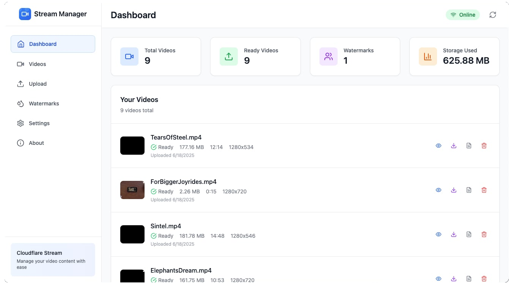

# Cloudflare Stream Manager




A beautiful, modern desktop application for managing your Cloudflare Stream video content with ease. Built with React, TypeScript, and Electron.

## ✨ Features

### 🎥 Video Management
- **Upload Videos**: Drag & drop or browse to upload videos to Cloudflare Stream
- **Video Library**: Browse and manage all your uploaded videos
- **Video Preview**: Stream videos directly in the app with detailed metadata
- **Download Videos**: Enable and download videos for offline use
- **Video Details**: View comprehensive information including resolution, duration, file size, and streaming URLs

### 🖼️ Watermark Support
- **Watermark Manager**: Upload and manage custom watermarks
- **Apply Watermarks**: Apply watermarks to videos during upload
- **Watermark Preview**: Preview watermarks before applying

### 📊 Dashboard & Analytics
- **Usage Statistics**: View total videos, ready videos, watermarks, and storage used
- **Real-time Updates**: Automatic refresh of statistics and video status
- **Status Monitoring**: Track video processing status (queued, processing, ready, error)

### 🌐 Network Awareness
- **Offline Detection**: Intelligent offline/online detection
- **Graceful Degradation**: Clear messaging when features require internet connectivity
- **Auto-reconnect**: Automatic data refresh when connection is restored

### ⚙️ Configuration & Settings
- **Secure Credentials**: Safely store Cloudflare API credentials locally
- **Account Management**: Easy setup and management of Cloudflare Stream API access
- **Settings Persistence**: All configurations saved locally for convenience

### ℹ️ System Information
- **About Page**: Detailed system specifications and application information
- **Technology Stack**: View all technologies and versions used in the app
- **Electron Integration**: Native desktop features and system integration

## 🚀 Quick Start

### Prerequisites
- **Node.js** 18+ 
- **npm** or **pnpm**
- **Cloudflare Account** with Stream API access

### Installation

1. **Clone the repository**
   ```bash
   git clone https://github.com/qya/cloudflare-stream-manager.git
   cd cloudflare-stream-manager
   ```

2. **Install dependencies**
   ```bash
   npm install
   ```

3. **Start development server**
   ```bash
   npm run electron:dev
   ```

### Setup Cloudflare Stream API

1. **Get your API credentials**:
   - Go to [Cloudflare Dashboard](https://dash.cloudflare.com)
   - Navigate to "My Profile" → "API Tokens"
   - Create a token with Stream permissions
   - Note your Account ID from the dashboard

2. **Configure in app**:
   - Launch the application
   - Enter your Account ID and API Token
   - Click "Save Configuration"

## 🛠️ Development

### Tech Stack
- **Frontend**: React 18 + TypeScript
- **Desktop**: Electron 28 with Electron Forge
- **Build Tool**: Vite 5
- **Styling**: Tailwind CSS 3
- **Icons**: Lucide React
- **API**: Cloudflare Stream API v1

### Available Scripts

```bash
# Development
npm run dev              # Start Vite dev server
npm run electron:dev     # Start Electron with hot reload
npm start               # Start with Electron Forge

# Building
npm run build           # Build React app
npm run package         # Package Electron app
npm run make            # Create platform installers

# Platform-specific builds
npm run make:win        # Windows (all architectures)
npm run make:win:x64    # Windows 64-bit
npm run make:win:ia32   # Windows 32-bit  
npm run make:linux      # Linux
npm run make:darwin     # macOS

# Utilities
npm run lint            # Run ESLint
npm run preview         # Preview built app
```

### Project Structure

```
src/
├── components/          # React components
│   ├── About/          # About page and system info
│   ├── Layout/         # Header, Sidebar, navigation
│   ├── Settings/       # Configuration forms
│   ├── Upload/         # Video upload components
│   ├── Videos/         # Video management
│   └── Watermarks/     # Watermark management
├── services/           # API services
│   ├── cloudflare.ts   # Cloudflare Stream API
│   └── tusUpload.ts    # TUS upload protocol
├── types/              # TypeScript definitions
└── App.tsx             # Main application component

electron/
├── main.ts             # Electron main process
└── preload.ts          # Preload script for security

build/
└── icon/               # Application icons
    ├── icon.ico        # Windows icon
    ├── icon.icns       # macOS icon
    └── icon.png        # Linux icon
```

## 📦 Building & Distribution

### Desktop Application

The app builds native desktop applications for multiple platforms:

#### Windows
- **Squirrel Installer** (`.exe`) - Modern auto-updating installer
- **MSI Installer** (`.msi`) - Traditional Windows installer
- **Portable ZIP** - No installation required
- **Architectures**: x64, x86 (32-bit)

#### macOS
- **App Bundle** (`.app`) - Native macOS application
- **ZIP Archive** - Compressed app bundle
- **Architecture**: ARM64 (Apple Silicon), x64 (Intel)

#### Linux
- **DEB Package** (`.deb`) - Debian/Ubuntu installer
- **RPM Package** (`.rpm`) - RedHat/Fedora installer
- **AppImage** - Portable Linux application

### Build Commands

```bash
# Build for current platform
npm run make

# Cross-platform builds (requires additional setup)
npm run make:win:x64     # Windows 64-bit
npm run make:win:ia32    # Windows 32-bit
npm run make:linux       # Linux
npm run make:darwin      # macOS
```

### Output Directory

Built applications are saved to:
- `out/make/squirrel.windows/` - Windows installers
- `out/make/wix/` - Windows MSI files
- `out/make/zip/` - Portable ZIP files
- `out/make/deb/` - Linux DEB packages
- `out/make/rpm/` - Linux RPM packages

## 🔧 Configuration

### Environment Variables

For production builds, you can set these environment variables:

```bash
# Windows Code Signing (optional)
WINDOWS_CERTIFICATE_FILE=/path/to/certificate.p12
WINDOWS_CERTIFICATE_PASSWORD=your_certificate_password

# App Store publishing (optional)
APPLE_ID=your_apple_id
APPLE_ID_PASSWORD=app_specific_password
```

### Cloudflare Stream API Setup

1. **Account ID**: Found in your Cloudflare dashboard sidebar
2. **API Token**: Create with these permissions:
   - Zone:Stream:Edit
   - Account:Cloudflare Stream:Edit
   - Account:Account:Read

## 🌟 Features in Detail

### Video Upload
- **Resumable Uploads**: Uses TUS protocol for reliable large file uploads
- **Progress Tracking**: Real-time upload progress with speed and ETA
- **Format Support**: MP4, MOV, AVI, MKV, WebM, and more
- **Watermark Integration**: Apply watermarks during upload

### Video Management
- **Bulk Operations**: Select and manage multiple videos
- **Status Monitoring**: Real-time processing status updates
- **Metadata Editing**: Update video names and descriptions
- **URL Generation**: Copy streaming URLs (HLS, DASH)

### Offline Support
- **Connection Detection**: Automatic online/offline status detection
- **Graceful Handling**: Clear messaging for offline-only features
- **Data Persistence**: Local storage of configuration and cache

### Security & Privacy
- **Local Storage**: All credentials stored locally, never transmitted
- **Context Isolation**: Secure Electron configuration
- **HTTPS Only**: All API communications over secure connections

## 🤝 Contributing

We welcome contributions! Please follow these steps:

1. **Fork the repository**
2. **Create a feature branch**: `git checkout -b feature/amazing-feature`
3. **Commit your changes**: `git commit -m 'Add amazing feature'`
4. **Push to the branch**: `git push origin feature/amazing-feature`
5. **Open a Pull Request**

### Development Guidelines

- Use TypeScript for all new code
- Follow the existing code style (ESLint configuration)
- Add tests for new features
- Update documentation as needed
- Ensure cross-platform compatibility

## 📋 Requirements

### System Requirements
- **Windows**: Windows 10 or later (x64, x86)
- **macOS**: macOS 10.15 (Catalina) or later
- **Linux**: Ubuntu 16.04+, Fedora 24+, or equivalent

### Development Requirements
- **Node.js**: 18.0.0 or later
- **npm**: 8.0.0 or later
- **Git**: For version control
- **Platform-specific build tools** (for cross-compilation)

## 📝 License

This project is licensed under the MIT License - see the [LICENSE](LICENSE) file for details.

## 👨‍💻 Author

**Fais.tech**
- Website: [fais.tech](https://fais.tech)
- GitHub: [@qya](https://github.com/qya)

## 🙏 Acknowledgments

- [Cloudflare Stream](https://cloudflare.com/products/cloudflare-stream/) - Video streaming infrastructure
- [Electron](https://electronjs.org/) - Desktop app framework
- [React](https://reactjs.org/) - UI library
- [Tailwind CSS](https://tailwindcss.com/) - CSS framework
- [Lucide](https://lucide.dev/) - Beautiful icons

## 📚 Additional Resources

- [Cloudflare Stream API Documentation](https://developers.cloudflare.com/stream/)
- [Electron Documentation](https://electronjs.org/docs)
- [React Documentation](https://reactjs.org/docs)
- [TypeScript Documentation](https://typescriptlang.org/docs)

---

**Built with ❤️ by Fais.tech** 
